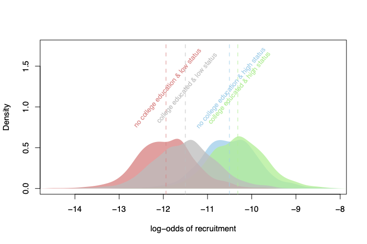
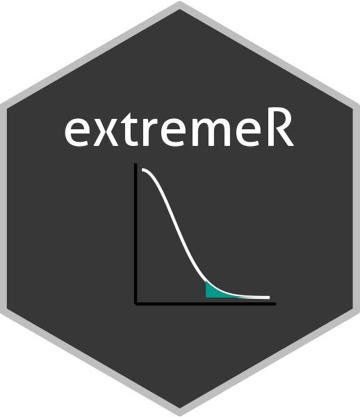

# bayesian-extreme



Repo of replication materials for "Explaining Recruitment to Extremism: A Bayesian Hierarchical Case-Control Approach." This is the final version control repository without data output (too large for Github). For full replication dataverse, see: <INSERT HARVARD DATAVERSE URL>.

## Package installation



The estimation procedure described in this article is provided as a standalone package called `extremeR`: <https://github.com/cjbarrie/extremeR>. The package has a standalone website, including tutorial run-through at: <https://extremer.info/>.

## Description of data

We use three main sources of data. These are all in the folder "data/".

1.  The principal raw data come leaked recruitment records. These are provided (with names, address etc.) as "master_data.csv."
2.  There are then three data sets of recruitment records merged with survey and administrative data. For all countries, this file is "matchadata_isisall.csv"; for Egypt "matchdata_isisegysc.csv"; and for Tunisia "matchdata_isistunsc.csv".
3.  The final dataset, "mena_pops.csv" is a list of population figures needed for the estimation procedure.

### Variables

For full descriptions of each variable and how they were coded, see the Appendix of the published article. Below, we detail short descriptions of each variable for ease of reference.

#### master_data.csv

| Variable Name   | Description                                                                     |
|-----------------|---------------------------------------------------------------------------------|
| person_ID       | unique identifier for each individual                                           |
| country         | name of the country where the individual lives                                  |
| name_0          | alternative country ID                                                          |
| country_ID      | alternative country ID                                                          |
| governorate     | name of the governorate where the individual lives                              |
| name_1          | alternative governorate ID                                                      |
| governorate_ID  | alternative governorate ID                                                      |
| gov_x           | x-coordinate of the governorate                                                 |
| gov_y           | y-coordinate of the governorate                                                 |
| case            | individual is case 1/0                                                          |
| edu_years       | number of years of education completed by the individual                        |
| level_edu_ABIII | educational level of the individual accorded with Arab Barometer                |
| coledu          | individual attended college                                                     |
| coledu_any      | individual attended any college                                                 |
| age             | age of the individual                                                           |
| married         | indicator variable for whether the individual is married                        |
| student         | indicator variable for whether the individual is a student                      |
| unemployed      | indicator variable for whether the individual is unemployed                     |
| agriman         | indicator variable for whether the individual is in agricultural or manual work |
| lowstat         | indicator variable for whether the individual is low status                     |

#### matchdata_isisall.csv.csv

| Variable Name   | Description                                                                     |
|-----------------|---------------------------------------------------------------------------------|
| ID              | unique identifier for each individual                                           |
| country         | name of the country where the individual lives                                  |
| governorate     | name of the governorate where the individual lives                              |
| edu_years       | number of years of education completed by the individual                        |
| level_edu_ABIII | educational level of the individual accorded with Arab Barometer                |
| coledu          | individual attended college                                                     |
| coledu_any      | individual attended any college                                                 |
| age             | age of the individual                                                           |
| married         | indicator variable for whether the individual is married                        |
| student         | indicator variable for whether the individual is a student                      |
| unemployed      | indicator variable for whether the individual is unemployed                     |
| agriman         | indicator variable for whether the individual is in agricultural or manual work |
| lowstat         | indicator variable for whether the individual is low status                     |
| case            | individual is case 1/0                                                          |

### matchdata_isisegysc.csv

| Variable Name                  | Description                                                                          |
|--------------------------------|--------------------------------------------------------------------------------------|
| country                        | name of the country where the individual lives                                       |
| governorate                    | name of the governorate where the individual lives                                   |
| district                       | name of the district where the individual lives                                      |
| edu_years                      | number of years of education completed by the individual                             |
| level_edu_ABIII                | educational level of the individual accorded with Arab Barometer                     |
| coledu                         | individual attended college                                                          |
| coledu_any                     | individual attended any college                                                      |
| age                            | age of the individual                                                                |
| married                        | indicator variable for whether the individual is married                             |
| student                        | indicator variable for whether the individual is a student                           |
| unemployed                     | indicator variable for whether the individual is unemployed                          |
| agriman                        | indicator variable for whether the individual is in agricultural or manual work      |
| lowstat                        | indicator variable for whether the individual is low status                          |
| total_population_2006          | total population count in 2006                                                       |
| christian_2006_pct             | percentage of the population that identifies as Christian in 2006                    |
| agriculture_2006_pct           | percentage of the population that is employed in agriculture in 2006                 |
| university_2006_pct            | percentage of the population that has a university education in 2006                 |
| population_density             | population density in the district                                                   |
| district_x                     | x-coordinate of the district                                                         |
| district_y                     | y-coordinate of the district                                                         |
| mursi_vote_2012_pct            | percentage of the district vote that was for Mursi in 2012                           |
| unemployment_2013q4_pct        | unemployment rate in the district in Q4 of 2013                                      |
| sqrt_killed_at_rabaa           | square root of the number of individuals killed at the Rabaa al-Adawiya sit-in       |
| distance_to_cairo              | distance from the district to Cairo                                                  |
| sqrt_distance_to_cairo         | square root of the distance from the district to Cairo                               |
| protest_post_Mubarak           | number of protests in the district after the overthrow of Mubarak                    |
| sqrt_protest_post_Mubarak      | square root of the number of protests in the district after the overthrow of Mubarak |
| distance_to_north_sinai        | distance from the district to North Sinai                                            |
| sqrt_distance_from_north_sinai | square root of the distance from the district to North Sinai                         |
| admin2Name_en                  | name of the district in English (from shapefile)                                     |
| admin2Name_ar                  | name of the district in Arabic (from shapefile)                                      |
| adm2_pcode                     | unique identifier for each district (from shapefile)                                 |
| admin1Name_en                  | name of the governorate in English (from shapefile)                                  |
| admin1Name_ar                  | name of the governorate in Arabic (from shapefile)                                   |
| admin1Pcode                    | unique identifier for each governorate (from shapefile)                              |
| case                           | individual is case 1/0                                                               |

### matchdata_isistunsc.csv

Here's a markdown table with two columns, one for the variable name, and one for a description of the variable:

| Variable name            | Description                                                                     |
|--------------------------|---------------------------------------------------------------------------------|
| country                  | name of the country where the individual lives                                  |
| governorate              | name of the governorate where the individual lives                              |
| delegation               | name of the delegation where the individual lives                               |
| edu_years                | number of years of education completed by the individual                        |
| level_edu_ABIII          | educational level of the individual accorded with Arab Barometer                |
| coledu                   | individual attended college                                                     |
| coledu_any               | individual attended any college                                                 |
| age                      | age of the individual                                                           |
| married                  | indicator variable for whether the individual is married                        |
| student                  | indicator variable for whether the individual is a student                      |
| unemployed               | indicator variable for whether the individual is unemployed                     |
| agriman                  | indicator variable for whether the individual is in agricultural or manual work |
| lowstat                  | indicator variable for whether the individual is low status                     |
| population_density       | population density in the delegation                                            |
| log_population_density   | log of population density in the delegation                                     |
| case                     | individual is case 1/0                                                          |
| pop_10plus_2014          | population age 10 years and above in 2014                                       |
| pct_higher_edu_2014      | percentage of population with higher education in 2014                          |
| pct_illit_2014           | percentage of population illiterate in 2014                                     |
| unemp_rate_2014          | unemployment rate in 2014                                                       |
| dip_unemp_rate_2014      | graduate unemployment in 2014                                                   |
| pct_agri_2014            | percentage of population working in agriculture in 2014                         |
| unemp_rate1519_2014      | unemployment rate for the population age 15-19 years in 2014                    |
| unemp_rate2024_2014      | unemployment rate for the population age 20-24 years in 2014                    |
| unemp_rate2529_2014      | unemployment rate for the population age 25-29 years in 2014                    |
| internet_use_2014        | percentage of population with internet in 2014                                  |
| idr                      | delegation development index                                                    |
| idr_rank                 | rank of delegation development index                                            |
| pop_10_plus_male_2014    | male population age 10 years and above in 2014                                  |
| pop_15_plus_2014         | population age 15 years and above in 2014                                       |
| pop_15_plus_male_2014    | male population age 15 years and above in 2014                                  |
| dip_unemp_rate_male_2014 | male graduate nemployment rate in 2014                                          |
| unemp_rate_male_2014     | male unemployment rate in 2014                                                  |
| distance_to_libya        | distance to the border with Libyas                                              |
| sqrt_distance_to_libya   | square root of the distance to the border with Libya                            |
| distance_to_tunis        | distance to Tunis in kilometers                                                 |
| sqrt_distance_to_tunis   | square root of the distance to Tunis                                            |
| post_rev_protest_events  | number of protest events after the 2011 Revolution                              |

## Computational requirements

-   Software used for final replication:

```         
platform       aarch64-apple-darwin20      
arch           aarch64                     
os             darwin20                    
system         aarch64, darwin20           
status                                     
major          4                           
minor          2.3                         
year           2023                        
month          03                          
day            15                          
svn rev        83980                       
language       R                           
version.string R version 4.2.3 (2023-03-15)
nickname       Shortstop Beagle     
```

-   Hardware used for final replication:

```         
      Model Name: MacBook Pro
      Model Identifier: MacBookPro18,3
      Model Number: Z15G0026LB/A
      Chip: Apple M1 Pro
      Total Number of Cores: 8 (6 performance and 2 efficiency)
      Memory: 32 GB
      System Firmware Version: 8419.80.7
      OS Loader Version: 8419.80.7
      Serial Number (system): C3YH39D4FF
      Hardware UUID: FA2D6AD0-E4D6-54E5-95DF-F4BC76BDA020
      Provisioning UDID: 00006000-001C41020A29801E
      Activation Lock Status: Enabled
```

-   Processing time for final analysis:
    -   000_simulation_study_round1.R : \~12 hours
    -   000_simulation_study_round2.R : \~12 hours
    -   01_analysis_egypt.R: \~3 hours
    -   02_analysis_tunisia.R: \~8 hours
    -   03b_analysis_bird.R: \~47 hours

## File structure

### Analysis scripts

-   ├── 000_simulation_study_round1.R : Runs first set of simulations
-   ├── 000_simulation_study_round2.R : Runs second set of simulations
-   ├── 01_analysis_egypt.R : "Worm's Eye" model estimation for Egypt
-   ├── 02_analysis_tunisia.R : "Worm's Eye" model estimation for Tunisia
-   ├── 03a_cleaning_bird.R : "Bird's Eye" model estimation data preparation
-   ├── 03b_analysis_bird.R: "Bird's Eye" model estimation

```         

├── 000_simulation_study_round1.R
├── 000_simulation_study_round2.R
├── 01_analysis_egypt.R
├── 02_analysis_tunisia.R
├── 03a_cleaning_bird.R
├── 03b_analysis_bird.R
├── README.md
├── bayesian-extreme.Rproj
├── bird.stan
├── data
│   ├── master_dataset.csv
│   ├── matchdata_isisall.csv
│   ├── matchdata_isisegysc.csv
│   ├── matchdata_isistunsc.csv
│   └── mena_pops.csv
├── egypt.stan
├── generated_data
│   ├── Bird
│   ├── Egypt
│   ├── Sims
│   └── Tunisia
├── plots
│   ├── Bird
│   ├── Egypt
│   ├── Sims
│   └── Tunisia
├── shapefiles/
├── tables
│   ├── profiles_bird.tex
│   ├── profiles_egy.tex
│   └── profiles_tun.tex
├── tunisia.stan
└── utils
    ├── monitornew.R
    ├── monitorplot.R
    ├── utils.R
    └── utils_plot.R
```
